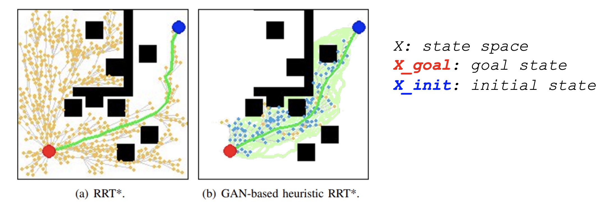
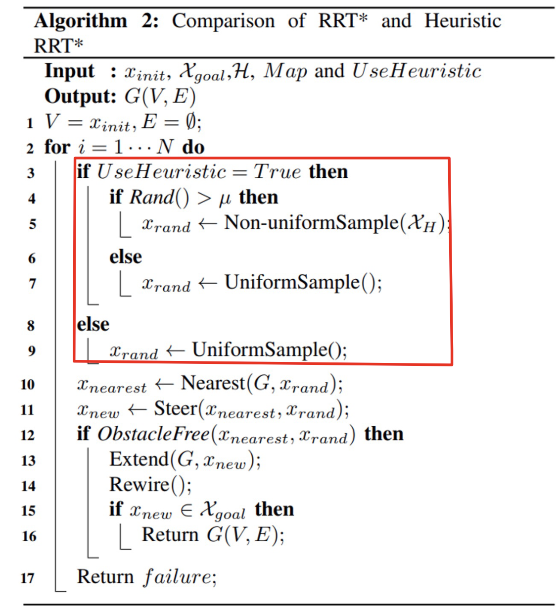

# GAN based Heuristics for Sampling-based Path Planning

## Path planning approaches:
- Gradient Based
- Combinatorial / Exact Algorithms
- Sampling Based

## RRT/RRT* (Sampling based)
- Find feasible path fast
    - (Most) Probabilistically complete ○ Finding optimal path
- Computationally expensive
- Not always realistic for some applications

## Heuristic Based RTT/RTT*
Generative Adversarial Network (GAN)
    - Delimiting a Region of Interest (ROI).
    - Sample ROI

* Samples are randomly chosen from
    - non-uniform sampling
    - GAN heuristic
* Trade-off between:
    - Efficiency
    - Still guarantee probabilistic completeness

